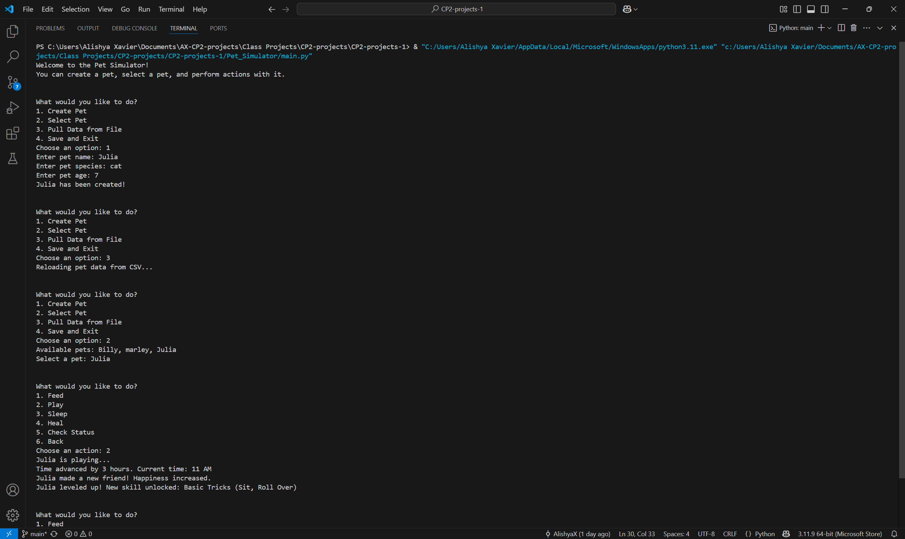

# Pet Simulator

## Project Description
---
The purpose of this project was to create a Pet Simulator using Python classes. This project focused on bject-oriented programming concepts, implementing game-like logic, and creating a simple text-based user interface. I designed a system to manage virtual pets, their attributes, and interactions.
 

## Execution and Usage
---
To use this project all you have to do is run the main file. Then you are introduced to the Pet Simulator and are given options to create a pet, select from all of the pets already made, pull pets from a saved file, and save your pets and exit. If you create a pet it asks you for the name, species, and age. Then you can select that pet as well as others that you either pull from a pre-made file or from which you made already to interact with. You can feed, play, sleep, heal, and check its status all while time passes during each event and random events occur. When you are ready to exit it saves all of the created pets to the same csv file for next time.
  

## Curent Features
---
+ I am proud of how I added sos many things for the pet to be able to do
+ I am also proud of how I was able to implement the sense of time through the simulator 
+ Lastly, I am proud of all the different skills I had that the pets can get when they Level up 

## Contributors
---
+ My dad - Helped me understand classes and how to use them properly 
+ Copilot - Helped me figure out why certain problems were happening and better ways to fix them 

## Authors Information
---
This project was completed by Alishya Xavier. She is a freshman in highschool at Utah County Academy of Sciences. She has been taking programming classes starting in middle school to be able to learn python and enjoy using it. Some other things she enjoys doing are baking, spending time with her friends, and playing volleyball. At the moment she is trying multiple different things in highschool to be able to be open minded and enjoy every moment in whatever she decides in her future. 
